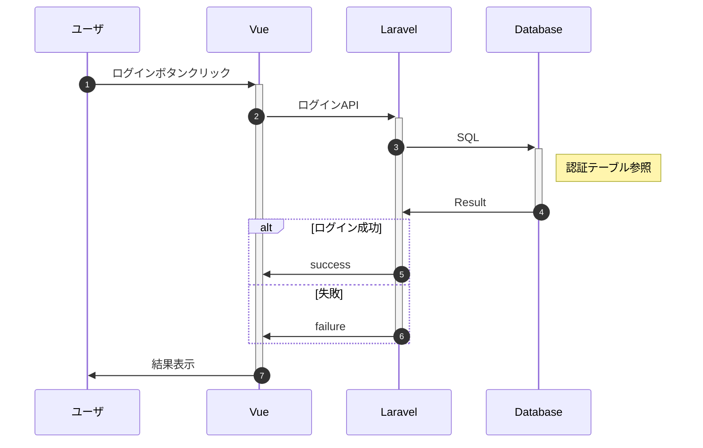

# #9システム設計書のバージョン管理法の確立

Excel以外で設計書を作成、管理したい。

## 取り組む内容

- [#9システム設計書のバージョン管理法の確立](#9システム設計書のバージョン管理法の確立)
  - [取り組む内容](#取り組む内容)
    - [1.Excelに変わる新たな設計書作成手段の導入](#1excelに変わる新たな設計書作成手段の導入)

### 1.Excelに変わる新たな設計書作成手段の導入

メリット

- テキストなので軽い
- Git等でバージョン管理が行える
- 変更履歴を差分として残すことができる
- シーケンス図などが簡単にきれいに記述できる
- 見た目がきれい
- html, pdf, docxファイルなど他形式への変換が可能
- 環境に依存しない（Officeが無くても使える）

デメリット

- 表の作成がしにくい　 → VS CodeだとExcelの表をコピペで簡単に作れる  ([参考](https://dev.classmethod.jp/articles/excel-to-markdown-table/))
- 画像をURL指定する必要がある → 調査中、修正に手間がかかりそう  
  ([参考：GitHubで画像を管理する方法](https://for-spring.com/computer/github-6/))&nbsp;  
  
エクセル、ワードとの比較

| シーン | エクセル, ワードの仕様書 | マークダウン仕様書 |
| --- | --- | --- |
| 差分 | とれるツールもあるが使い勝手が悪い | Git diffで変更箇所が明確 |
| 修正点の指摘 | 指摘リストのエクセルなどを作り、担当が修正し、再度確認を行っている。| GitHubを利用すればプルリクエストで第三者も容易に修正提案ができ、マージを終了した時点で修正が完了し、再度確認をする必要もない。|
| 表作成 | エクセルが使いやすい | エクセルには勝てないが、エクセルの表から変換可能。cvsファイルも読み込み可能。 |
| 変更管理 | 変更管理ページを設け記載するため、変更記録に抜け漏れが発生する。わざわざ修正箇所を赤字にしている。 | バージョン管理ツールにログとして残るため明確 |
| 仕様書参照 | 技術的には可能(ハイパーリンク機能)だが運用されていないため、毎回文書を開き直し、該当箇所を探している | 相互にリンクを貼ることが当たり前になっていて、問題の箇所がすぐに見られる |

&nbsp;  

図1a
