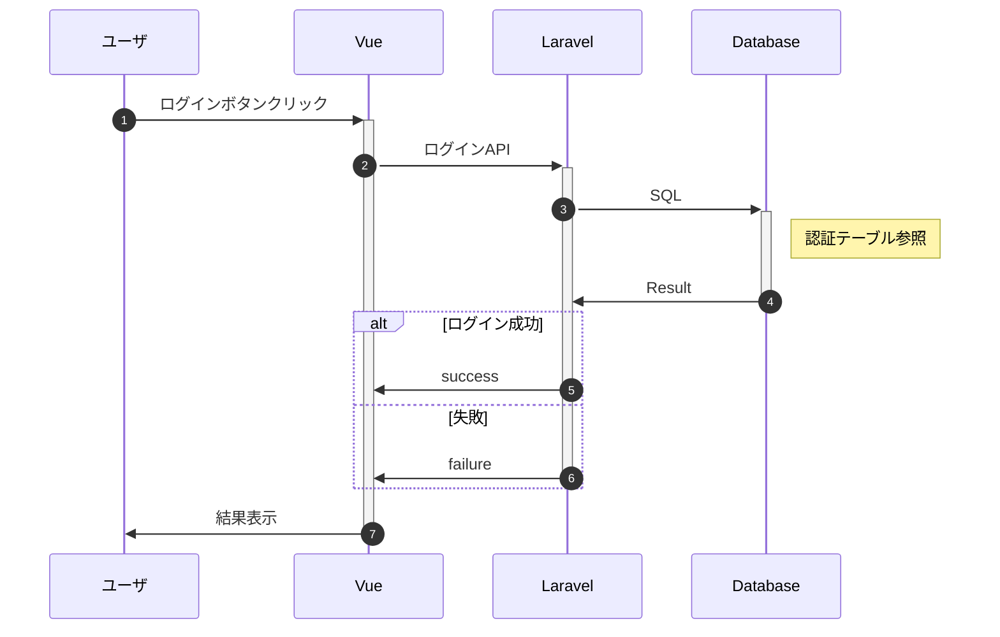

# 画像テスト用

〜〜〜

## 目次

- [画像テスト](#画像テスト用)
  - [目次](#目次)
    - [1.画像](#1.画像を載せる)
    - [2.画像](#2.画像を載せる)

### 1.画像を載せる
ここ↓  
〜  
〜  
〜  
〜  

```mermaid
%%{init:{'theme':'natural'}}%%
sequenceDiagram
autonumber
  ユーザ    ->> +Vue         : ログインボタンクリック
  Vue      ->> +Laravel     : ログインAPI
  Laravel  ->> +Database    : SQL
    Note right of Database  : 認証テーブル参照
  Database ->> -Laravel     : Result
  alt ログイン成功
    Laravel ->> Vue         : success
  else 失敗
    Laravel ->> -Vue        : failure
  end
  Vue       ->> -ユーザ      : 結果表示
```

### 2.画像を載せる